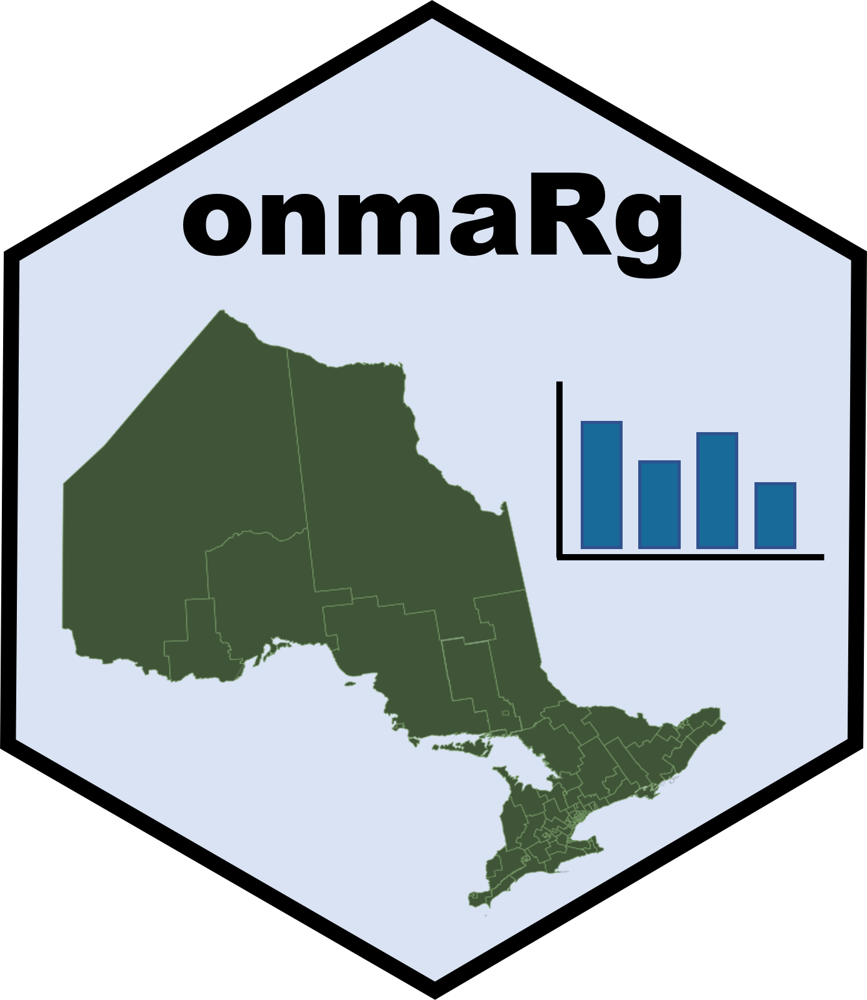
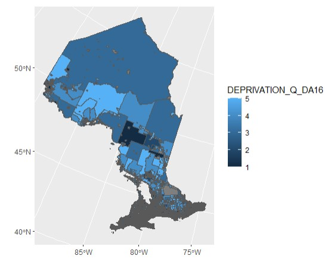

# onmaRg Package 

## Purpose

**onmaRg** is an R package designed to simplify the process of accessing and merging Ontario Marginalization data for spatial analysis. The library offers functions that seamlessly join marginalization data with geographic data, enabling researchers and analysts to work more efficiently with socio-economic datasets.

onmaRg retrieves data directly from government sources, merging them into data frames without creating any local files. This makes it easier to conduct spatial analysis without the need for manual data handling or file management.

## Background

The **Ontario Marginalization Index** is a data model developed and maintained by Ontario Public Health in collaboration with St. Michael's Hospital. It assesses marginalization across four key domains: Residential Instability, Material Deprivation, Dependency, and Ethnic Concentration. These domains capture various dimensions of marginalization experienced by communities. The data is available both as continuous decimal values and in quintiles (1 to 5), where 5 represents the highest level of marginalization for that domain (e.g., a score of 5 in deprivation indicates the highest level of deprivation).

In addition to this, Statistics Canada provides geographic boundary shapefiles for all of Canada, which include precise geographic units, such as Dissemination Areas.

**onmaRg** combines data from both these sources to create shapefiles that incorporate marginalization data for each geographic unit. This automation streamlines the process of downloading, cleaning, and merging files, making it significantly easier to analyze and visualize spatial data.

**onmaRg** also calculates an overall index score by averaging the quintile scores across the four domains, providing a comprehensive measure of marginalization for each area.

## Available Data

The **Ontario Marginalization Index** publishes marginalization data every five years, starting from 2001. Currently, onmaRg can retrieve data from the following years:
- 2011
- 2016
- 2021

Additionally, **onmaRg** supports data retrieval at various geographic levels, including:
- DAUID (Dissemination Area)
- CTUID (Census Tract)
- CSDUID (Census Subdivision)
- CCSUID (Census Consolidated Subdivision)
- CMAUID (Census Metropolitan Area)
- CDUID (Census Division)
- PHUUID (Public Health Unit)
- LHIN_SRUID (Local Health Integration Network Sub-Region)
- LHINUID (Local Health Integration Network)

**onmaRg** will be updated with each new data release to ensure it remains current. The 2001 and 2006 datasets have been excluded due to formatting differences, but they will be included in future versions.

## Usage

The `shapeMarg()` function is used to download the data into a variable - simply put in the year of data requested and the level of precision. This example will showcase how to use the package to quickly make a geographic plot of material deprivation data:

```r
library(onmaRg)
library(ggplot2)
library(sf)

# Loads OnMarg data from 2016 on the DA level
DA_2016 <- shapeMarg(2016, "DAUID")

# Plots the material deprivation quintile scores
ggplot() +
    geom_sf(data=DA_2016, aes(fill=DEPRIVATION_Q_DA16)) +
    coord_sf()
```


---

## Citations

Matheson FI (Unity Health Toronto), Moloney G (Unity Health Toronto), van Ingen T (Public Health Ontario). 2021 Ontario marginalization index: user guide. Toronto, ON: St. Michael’s Hospital (Unity Health Toronto); 2023. Joint publication with Public Health Ontario.

Government of Canada, Statistics Canada. (2021, November 17). List of 2021 census boundary files depicting boundaries of 2021 census standard geographic areas for which census data are available. 2021 Census Boundary files. https://www12.statcan.gc.ca/census-recensement/2021/geo/sip-pis/boundary-limites/index2021-eng.cfm?year=21

Government of Canada, S. C. (2022, February 10). 2021 census. Geographic Attribute File. https://www12.statcan.gc.ca/census-recensement/2021/geo/aip-pia/attribute-attribs/index2021-eng.cfm

**How to cite this package:**

```bibtex
@software{Conley_onmaRg_2024,
  author = {Conley, William},
  month = {10},
  title = {{onmaRg Package}},
  url = {https://github.com/WiIIson/onmaRg},
  version = {1.0.3},
  year = {2024},
  note = "{\tt william@cconley.ca}"
}
```